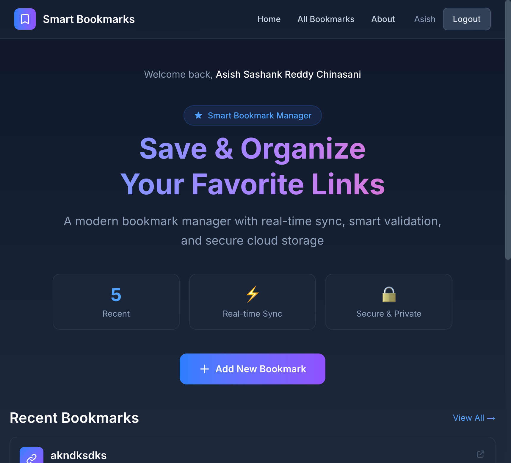
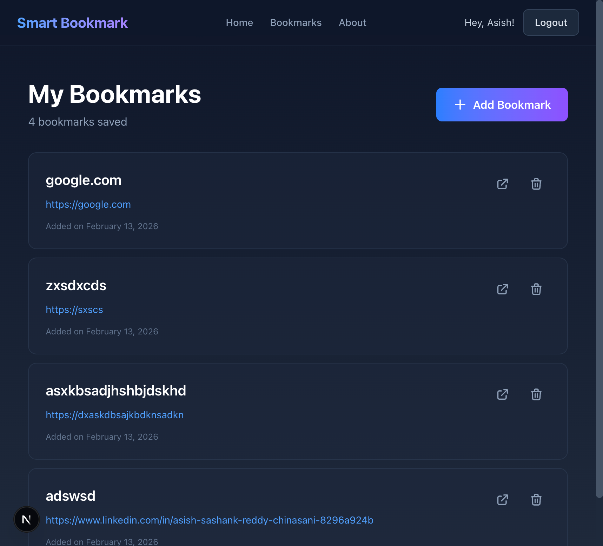
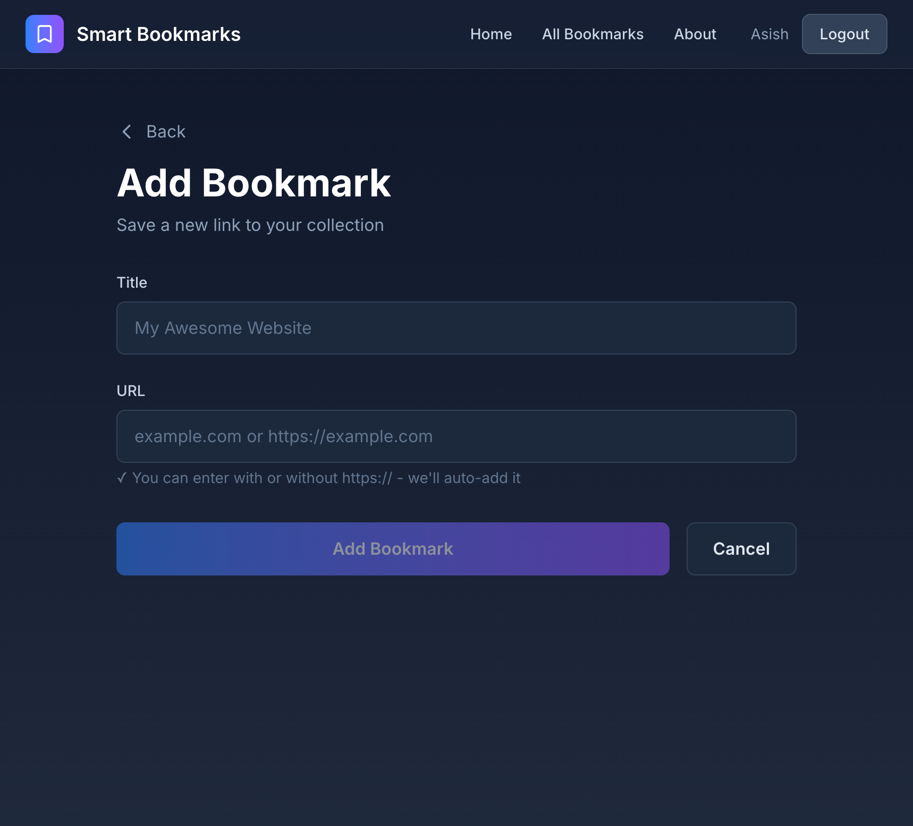

# 📚 Smart Bookmark Manager

A modern, real-time bookmark management application built with Next.js, Supabase, and TypeScript. Save, organize, and access your favorite links from anywhere with instant synchronization across all your devices.

🔗 **Live Demo:** https://smart-bookmark-app-iota-seven.vercel.app

---

## ✨ Features

- 🔐 **Secure Authentication** - Sign in with Google OAuth (no passwords needed)
- 📚 **Bookmark Management** - Create, view, and delete bookmarks with ease
- 🔒 **Private & Secure** - Your bookmarks are completely private with Row Level Security
- ⚡ **Real-time Sync** - Changes appear instantly across all open tabs
- ✅ **URL Validation** - Smart validation with auto-https:// addition
- 🎨 **Modern UI** - Clean, responsive dark mode design
- 🧪 **Tested** - 24/24 automated tests passing

---

## 🛠️ Tech Stack

### Frontend
- **Next.js 14** (App Router)
- **React 18**
- **TypeScript**
- **Tailwind CSS**

### Backend
- **Supabase** (PostgreSQL Database)
- **Supabase Auth** (Google OAuth)
- **Supabase Realtime** (WebSocket subscriptions)
- **Row Level Security (RLS)**

### Testing
- **Jest**
- **React Testing Library**

---

## 🚀 Getting Started

### Prerequisites
- Node.js 18+ installed
- Supabase account
- Google OAuth credentials

### Installation

1. **Clone the repository**
```bash
git clone https://github.com/asishcs2011010/smart-bookmark-app.git
cd smart-bookmark-app
```

2. **Install dependencies**
```bash
npm install
```

3. **Set up environment variables**

Create a `.env.local` file in the root directory:

```env
NEXT_PUBLIC_SUPABASE_URL=your_supabase_url
NEXT_PUBLIC_SUPABASE_ANON_KEY=your_supabase_anon_key
```

4. **Set up Supabase**

Run this SQL in your Supabase SQL Editor:

```sql
-- Create bookmarks table
CREATE TABLE bookmarks (
  id UUID PRIMARY KEY DEFAULT gen_random_uuid(),
  user_id UUID REFERENCES auth.users(id) ON DELETE CASCADE NOT NULL,
  title TEXT NOT NULL,
  url TEXT NOT NULL,
  created_at TIMESTAMPTZ DEFAULT NOW()
);

-- Enable Row Level Security
ALTER TABLE bookmarks ENABLE ROW LEVEL SECURITY;

-- Create policies
CREATE POLICY "Users can read own bookmarks" 
  ON bookmarks FOR SELECT 
  USING (auth.uid() = user_id);

CREATE POLICY "Users can insert own bookmarks" 
  ON bookmarks FOR INSERT 
  WITH CHECK (auth.uid() = user_id);

CREATE POLICY "Users can delete own bookmarks" 
  ON bookmarks FOR DELETE 
  USING (auth.uid() = user_id);

CREATE POLICY "Users can update own bookmarks" 
  ON bookmarks FOR UPDATE 
  USING (auth.uid() = user_id);

-- Enable Realtime
ALTER PUBLICATION supabase_realtime ADD TABLE bookmarks;
```

5. **Configure Google OAuth**

- Go to [Google Cloud Console](https://console.cloud.google.com/)
- Create OAuth 2.0 credentials
- Add authorized redirect URI: `https://your-project.supabase.co/auth/v1/callback`
- Add credentials to Supabase Authentication settings

6. **Run the development server**
```bash
npm run dev
```

Open [http://localhost:3000](http://localhost:3000)

---

## 🧪 Running Tests

```bash
# Run all tests
npm test

# Run tests in watch mode
npm run test:watch

# Run tests with coverage
npm test -- --coverage
```

**Test Results:** ✅ 24/24 tests passing

---

## 📁 Project Structure

```
smart-bookmark-app/
├── src/
│   ├── app/
│   │   ├── page.tsx                    # Home page
│   │   ├── login/
│   │   │   └── page.tsx                # Login page
│   │   ├── bookmarks/
│   │   │   └── page.tsx                # All bookmarks page
│   │   ├── add-bookmark/
│   │   │   ├── page.tsx                # Add bookmark form
│   │   │   ├── validation.ts           # URL validation logic
│   │   │   └── __tests__/
│   │   │       └── validation.test.ts  # Jest tests
│   │   ├── about/
│   │   │   └── page.tsx                # About page
│   │   ├── auth/
│   │   │   └── callback/
│   │   │       └── route.ts            # OAuth callback
│   │   └── layout.tsx                  # Root layout with navbar
│   └── lib/
│       └── supabaseClient.ts           # Supabase client setup
├── jest.config.js                      # Jest configuration
├── jest.setup.js                       # Jest setup
└── package.json
```

---

## 🎯 Key Features Explained

### 1. Real-time Synchronization
Uses Supabase Realtime to subscribe to database changes. When you add or delete a bookmark in one tab, it instantly appears/disappears in all other tabs without page refresh.

```typescript
const channel = supabase
  .channel('bookmarks-changes')
  .on('postgres_changes', { 
    event: '*', 
    schema: 'public', 
    table: 'bookmarks' 
  }, (payload) => {
    // Update UI based on INSERT, DELETE, or UPDATE events
  })
  .subscribe()
```

### 2. URL Validation
Smart URL validation with:
- Auto-adds `https://` if missing
- Validates URL format
- Checks for valid domain structure
- Shows real-time error messages
- Optional reachability check

### 3. Row Level Security
Every bookmark is tied to a user. PostgreSQL RLS policies ensure:
- Users can only see their own bookmarks
- Users can only delete their own bookmarks
- Complete data isolation between users

### 4. Authentication Flow
- User clicks "Sign in with Google"
- Redirects to Google OAuth
- Returns to `/auth/callback` route
- Session stored in Supabase
- Protected routes check authentication

---

## 🐛 Challenges & Solutions

### Challenge 1: Realtime Not Working Across Tabs
**Problem:** Realtime subscriptions were enabled, but changes in one tab didn't appear in another.

**Solution:** The issue was with Row Level Security policies. The realtime subscription wasn't properly authenticated. Fixed by:
1. Using `createBrowserClient` from `@supabase/ssr` for proper session management
2. Verifying user authentication before setting up subscriptions
3. Using unique channel names with timestamps to prevent conflicts

```typescript
const { data: { user } } = await supabase.auth.getUser()
if (!user) return

const channel = supabase.channel('bookmarks-' + Date.now())
```

### Challenge 2: WebSocket Connection Closing Repeatedly
**Problem:** Realtime worked initially but WebSocket kept closing with "CLOSED" and "TIMED_OUT" errors.

**Solution:** The `useEffect` was creating new subscriptions on every re-render. Implemented:
1. Proper cleanup with `isSubscribed` flag to prevent race conditions
2. Empty dependency array to run effect only once
3. Channel removal in cleanup function

```typescript
useEffect(() => {
  let isSubscribed = true
  // ... setup subscription
  return () => {
    isSubscribed = false
    if (channel) supabase.removeChannel(channel)
  }
}, []) // Empty dependency array
```

### Challenge 3: Ugly Browser Delete Confirmation
**Problem:** Default browser `confirm()` popup looked outdated and didn't match the app's design.

**Solution:** Built a custom modal with:
- Glassmorphism design with backdrop blur
- Warning icon and clear messaging
- Cancel/Delete buttons matching app theme
- React state management for modal visibility

### Challenge 4: CSS Gradient Not Rendering
**Problem:** Gradient buttons showed as plain colors instead of gradients.

**Solution:** Fixed typo in Tailwind class: `bg-linear-to-r` → `bg-gradient-to-r`

### Challenge 5: Google OAuth Callback Configuration
**Problem:** Setting up Google OAuth required proper callback URLs in Next.js App Router.

**Solution:**
1. Created `/auth/callback/route.ts` to handle OAuth response
2. Configured correct redirect URLs in both Google Console and Supabase
3. Used middleware to protect routes and redirect unauthenticated users

---

## 📝 Environment Variables

| Variable | Description |
|----------|-------------|
| `NEXT_PUBLIC_SUPABASE_URL` | Your Supabase project URL |
| `NEXT_PUBLIC_SUPABASE_ANON_KEY` | Your Supabase anonymous key |

---

## 🚀 Deployment

### Deploy to Vercel

1. **Push to GitHub**
```bash
git add .
git commit -m "Ready for deployment"
git push origin main
```

2. **Deploy on Vercel**
- Go to [vercel.com](https://vercel.com)
- Import your GitHub repository
- Add environment variables
- Deploy!

3. **Update Supabase URLs**
- Add your Vercel URL to Supabase Authentication → URL Configuration
- Update redirect URLs in Google OAuth settings

---

## 📊 Database Schema

```sql
bookmarks
├── id (UUID, Primary Key)
├── user_id (UUID, Foreign Key → auth.users)
├── title (TEXT)
├── url (TEXT)
└── created_at (TIMESTAMPTZ)
```

---

## 🤝 Contributing

This is a portfolio project, but feedback and suggestions are welcome!

---

## 📄 License

MIT License - feel free to use this project for learning purposes.

---

## 👨‍💻 Author

Asish Sashank Reddy Chinasani
- GitHub: [asishcs2011010](https://github.com/asishcs2011010)
- LinkedIn: [Asish Sashank Reddy Chinasani](https://www.linkedin.com/in/asish-sashank-reddy-chinasani-8296a924b)

---

## 🙏 Acknowledgments

- Built as a full-stack development showcase
- Supabase for the amazing backend platform
- Next.js team for the excellent framework
- Tailwind CSS for the utility-first styling

---

## 📸 Screenshots

### Home Page


### Bookmarks Page


### Add Bookmark


---

**⭐ If you found this project helpful, please give it a star!**